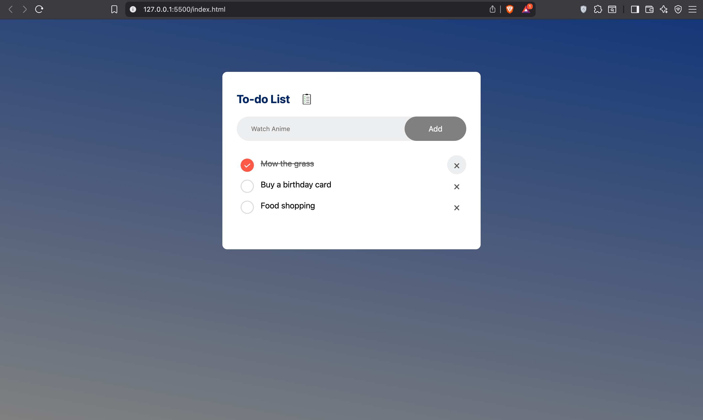

# Web-Based To-Do List
A simple Web-based task manager built using HTML, CSS and JavaScript. 

# Description
A lightweight and easy to use to-do list that allows users to add, check off and delete tasks when completed. Tasks are persistent until actively removed by user. 

## Features 
- Add new tasks to the list using the entry field and the submission button.
If the user leaves the submission field empty and attempt to submit, the browser will throw
back an error prompting the user to add something into the submission field. 

- Allows the user to check off completed items from the list, or delete them as they
see fit to do so.

- Maintains the user's list when the browser is closed or refreshed. Items on the list are
  only deleted when the user intenionally does so.

- Users can add tasks to the list by pressing the ente key, or manually clicking on the "Add" button.

- Placeholder value is persistent in the entry field to show users where to type their tasks.

## How it works
- Task is entered into the input field.

- Each task is added by the enter key or pressing the "Add" button.

- Task is clicked to indicate complete.

- Custom "X" icon clicked to remove task from list.

-Tasks saved automatically and persistent across web sessions. Require manual user removal. 

## File structure
- index.html

- styles.css

- script.js

- images/

- icon.png0 # Checklist icon

- unchecked.png # Empty checkbox icon

- checked.png # Checked/ completed task icon

##Future update potential
- Ability to edit tasks after input rather than deletion and re-entry.

- Task categorisation

##Demo

##Built by Tom using resources from forums and youtube along with my own knowledge so far of HTML, CSS and JavaScript. 

